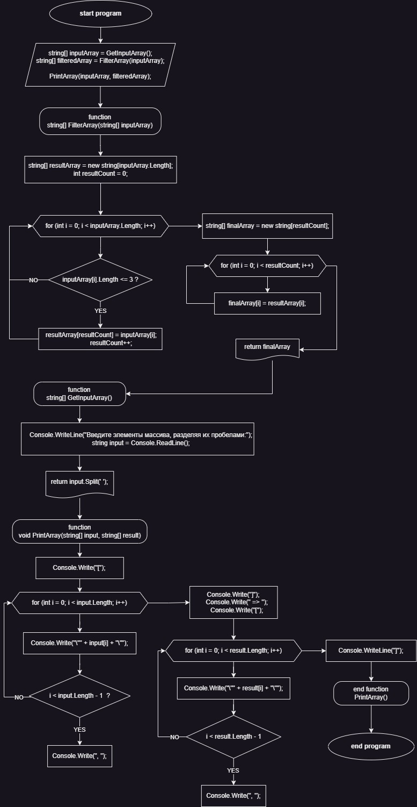

# Задача: Фильтрация строк

Написать программу, которая из имеющегося массива строк формирует новый массив из строк, длина которых меньше, либо равна 3 символам.

## Алгоритм решения

## Примеры

Входной массив: ["Hello", "2", "world", ":-)"]
Результат: ["2", ":-)"]

Входной массив: ["1234", "1567", "-2", "computer science"]
Результат: ["-2"]

Входной массив: ["Russia", "Denmark", "Kazan"]
Результат: []
